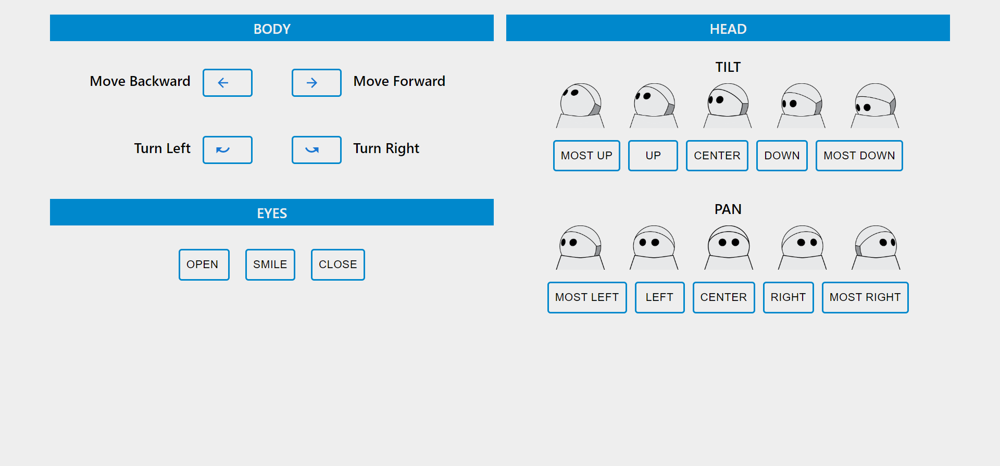

# Introduction

This is a project of the interaction with Kuri through web app using React. Although we could find keyboard extention codes to interact with Kuri, this repository should be helpful to whom building web interface with React. 



## Available Scripts

In the project directory, you can run:

### `npm start`

Runs the app in the development mode.\
Open [http://localhost:3000](http://localhost:3000) to view it in your browser.

The page will reload when you make changes.\
You may also see any lint errors in the console.

### `npm test`

Launches the test runner in the interactive watch mode.\
See the section about [running tests](https://facebook.github.io/create-react-app/docs/running-tests) for more information.

*The test code is not prepared yet.

### `npm run build`

Builds the app for production to the `build` folder.\
It correctly bundles React in production mode and optimizes the build for the best performance.

The build is minified and the filenames include the hashes.\
Your app is ready to be deployed!

See the section about [deployment](https://facebook.github.io/create-react-app/docs/deployment) for more information.

## Steps to Launching

In Kuri, please make sure that rosbridge and roslaunch are available in Kuri (http://wiki.ros.org/rosbridge_suite). Compatible OS are Melodic and Noetic.

Also, we are using react-ros (https://github.com/flynneva/react-ros) package to build connections.

- From local computer, run following commands
```
ssh -L 9090:localhost:9090 [name]@[kuri-name]
pw: [password]
cd workspace_yx_test
source devel/setup.bash
roslaunch rosbridge_server rosbridge_websocket.launch
```

- Then, open another command prompt and run `npm run start` under cloned repository.

- The location of launch files are under `../workspace/src/kuri_edu/launch`. When you need rosrun, the accosiated files are located `../workspace/src/kuri_teleop/scripts`.


- Here is Kuri's documentation `http://docs.freekuri.com/reference/ros-launch-files/`.

For more details, please feel free to send email to me tamaru@wisc.edu.

### License
MIT &copy; @raynbowy23